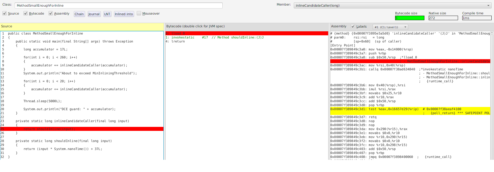
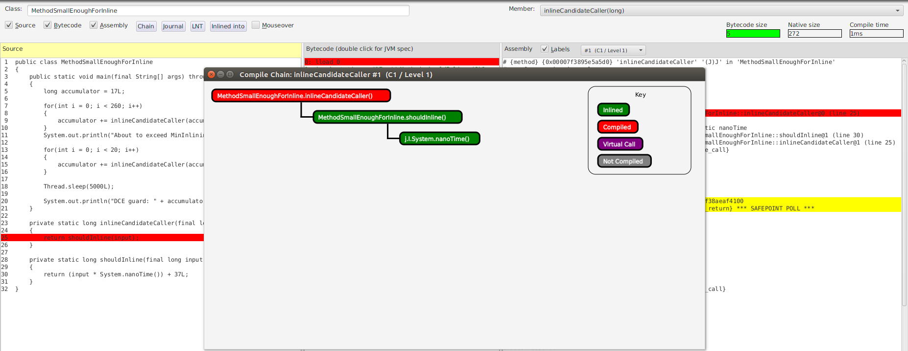
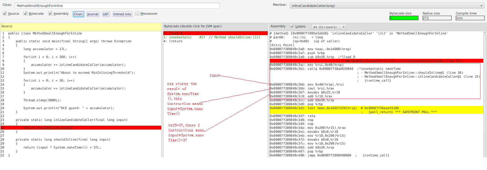
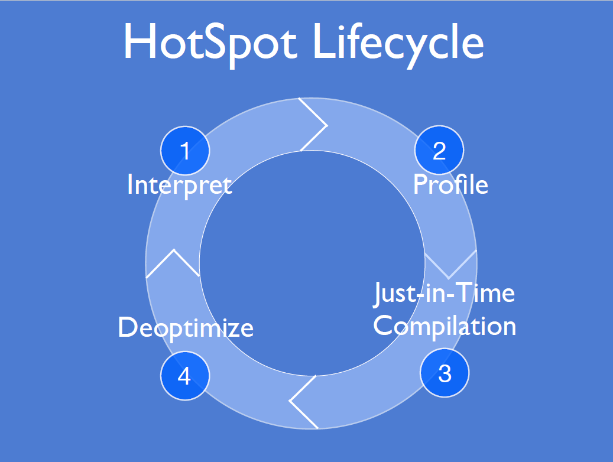
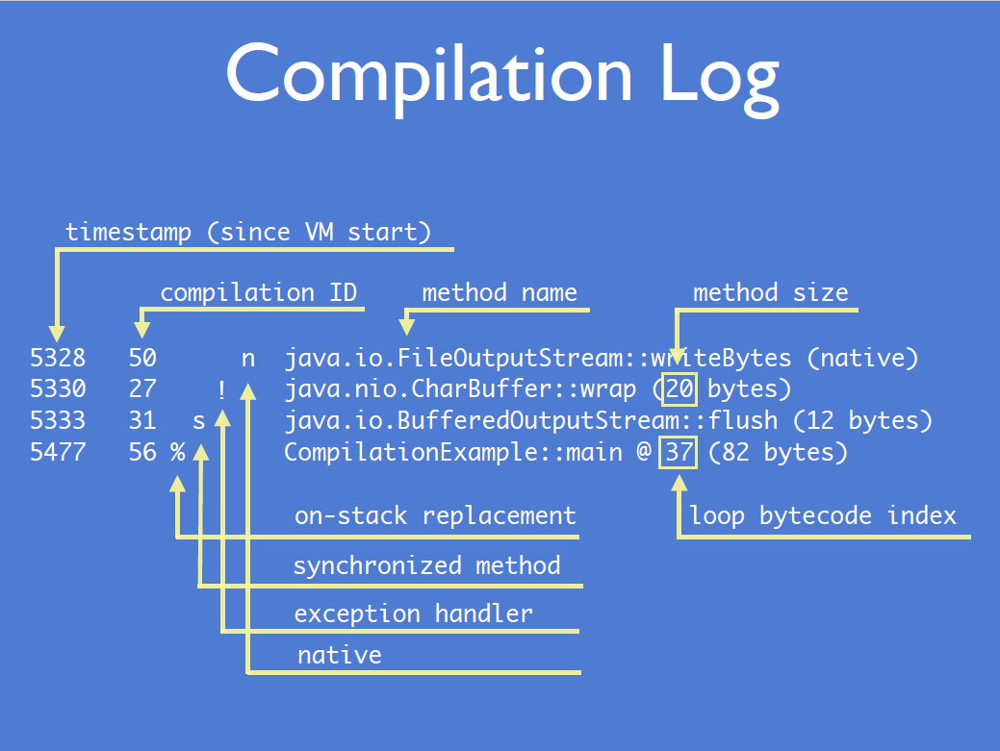
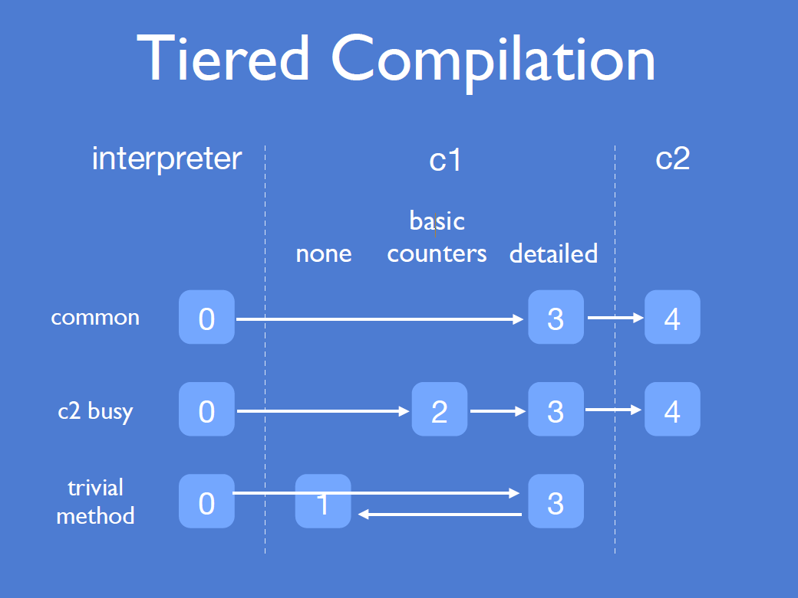
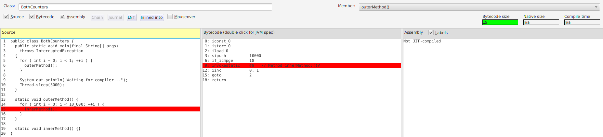
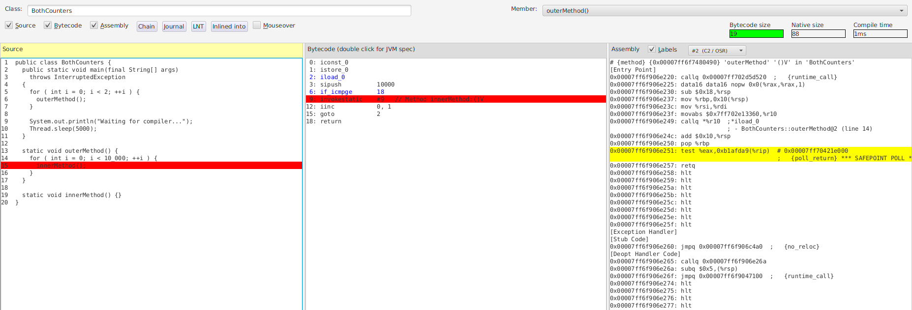
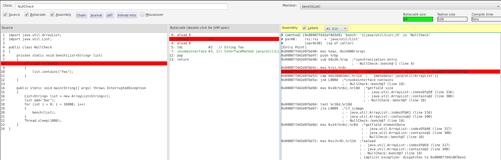
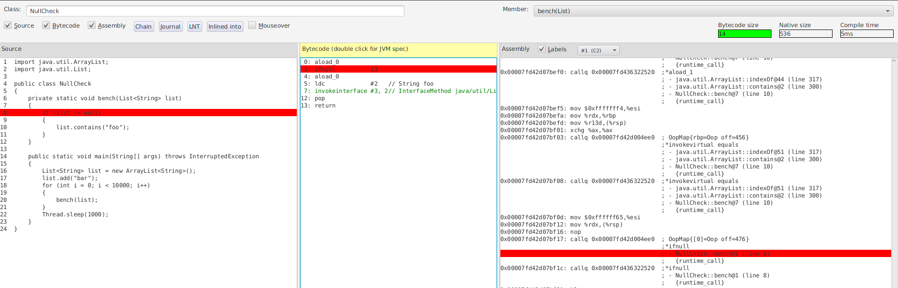

小A潜心JAVA外功已经多年，“功力深厚”，娴熟linux常用命令和工具，对设计模式信手拈来，CLEAN CODE的践行者，帮同事排查棘手问题时思路也是层出不穷，让刚入坑的后生好是羡慕。

其久未更新的个人牌匾上也明确地写着：

>1.	能心算简单JAVA字节码到源代码
```java
  public static int tiny();
    Code:
       0: iconst_2
       1: ireturn
```
>2. 能娴熟使用mat/visualvm/jconsole排查性能问题
>3. 喜欢阅读并试着鼓捣过开源项目的Demo

但是小A心里清楚，自己的“外功”虽然扎实，但内力修为不够：
虽然耳闻过**JMM,JLS,GC,JIT**的大名，偶尔也从其他高人处窥得一招半式，但要融会贯通，却是万万不能够。

时值GOOGLE集纵家之所长，JAVA，C++，Python均不在话下，武功独步天下。面对这样那样的困惑，小A毅然决定拜师GOOGLE名下。
GOOGLE感其诚，口授**JMH（Java Microbenchmark Harness）**真诀。

通过学习和实践，小A习得**JMH**大法3层功力，略有小成，于是决定下山，一试身手。


# JMH SHARING

## Prepare

### Get source code

```bash
git clone https://github.com/henryceowzm/jvm-mechanics.git
```

### Compile
```bash
cd jvm-mechanics
mkdir -p bin
javac -cp ./lib/*:$CLASSPATH -d bin $(find ./src -name "*.java")
```

### Generate scripts
```bash
java -cp ./bin:$CLASSPATH support.GenSh
```

```bash
javac -cp ./lib/*:$CLASSPATH -d bin $(find ./src -name "*.java") && java -cp ./bin:$CLASSPATH support.GenSh
grep 'highlight' -r src/ -l
```

## Getting start
```bash
cd scripts
sh example12.sh
javap -cp ./bin:$CLASSPATH -c -p example12.Tiny | ack --color --passthru "tiny"
```

## Warmup

### Inline
```bash
java -XX:+PrintFlagsFinal 2>&1 | grep -i inlin
sh example14a.sh
javap -cp ./bin:$CLASSPATH -c -p example14a.MethodSmallEnoughForInline | ack --color --passthru "shouldInline"
```
```bash
cd /home/henry/practice/jitwatch
./launchUI.sh > /dev/null 2>&1 &
```

**jitwatch TriView**
___


**jitwatch Compile Chain**
___

**jitwatch assembly**
___


### Invocation counter
```bash
java -XX:+PrintFlagsFinal 2>&1 | grep -i threshold
sh example02.sh
```

**HotSpot Lifecycle**
___


**Compilation Log**
___


**Tiered Compilation**
___


### BackEdge counter
```bash
java -XX:+PrintFlagsFinal 2>&1 | grep -i threshold
sh example03.sh
sh example04.sh
```
**Counter reaches 10000**
___


**Counter reaches 20000**
___


> **Counter is accumulative.**

### Implicit null check
**Naive demo of segv signal handler in c**
___
```bash
gcc segv_signal_handler.c -o segv_signal_handler
./segv_signal_handler &
```
**Speculate right executes fast path**
___


**Speculate wrong executes slow path**
___


>**Essentially a SEGV signal handler.**

### Escape analysis
**No Integer object is allocated as result of Escape analysis**
___


## Pitfalls

### DCE
```bash
sh example12.sh
cd /home/henry/practice/jmh-test
mvn clean install
java -jar target/benchmarks.jar -h
java -jar target/benchmarks.jar -l
java -jar target/benchmarks.jar -i 5 -wi 5 -f 2 "org.sample.JMHSample_08_DeadCode.*"
```

## JMH

### Install
```java
mvn archetype:generate \
          -DinteractiveMode=false \
          -DarchetypeGroupId=org.openjdk.jmh \
          -DarchetypeArtifactId=jmh-java-benchmark-archetype \
          -DgroupId=org.sample \
          -DartifactId=jmh-test \
          -Dversion=1.0
```
### Build
```bash
cd jmh-test/
mvn clean install
```

## JMH example

[JMH example](http://hg.openjdk.java.net/code-tools/jmh/file/tip/jmh-samples/src/main/java/org/openjdk/jmh/samples/)
